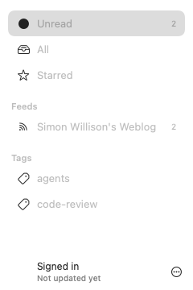
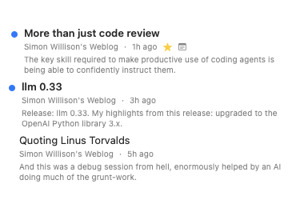
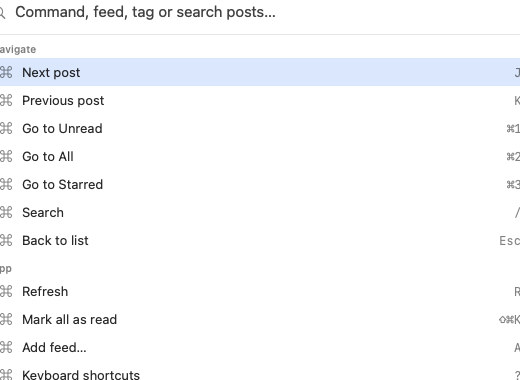
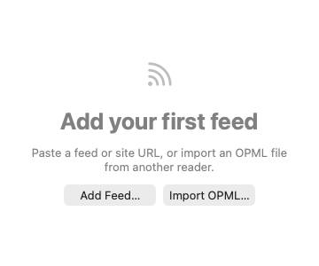

# Feed Reader

A self-hosted feed reader for one person: RSS and Atom feeds plus newsletters delivered by e-mail, in a single unread queue you can read from the web, from a native macOS app, or through an AI assistant connected over MCP. One Postgres database is the source of truth; every client writes through to it.

The hosted instance at `reader.sereno.dev.br` is the author's and has sign-ups closed. To use Feed Reader, run your own copy: it fits in Vercel's and Neon's free tiers. See **[Self-host](#self-host)**.

## Features

- **Feeds and newsletters together.** Subscribe by site or feed URL (the server resolves the feed), import OPML, and read newsletters as feeds: a free [Kill the Newsletter](https://kill-the-newsletter.com) inbox works out of the box, or point a subdomain's MX at [Resend Receiving](https://resend.com/docs/dashboard/receiving/introduction) so the server ingests mail itself (optional).
- **Web app** (TanStack Start on Vercel): mobile-first, installable PWA, keyboard-driven ([shortcuts](docs/shortcuts.md)), notes, tags, starred items, categories.
- **Native macOS app** (SwiftUI): signs in with OAuth in your browser, mirrors the server into a local SQLite database for instant startup and offline reading. See [`macos/README.md`](macos/README.md).
- **MCP for Claude and other assistants.** The server is an OAuth 2.1 provider and exposes a remote MCP endpoint at `/api/mcp`, so an assistant can read the same inbox, mark items, star, tag, take notes and subscribe.
- **Scheduled refresh** via Vercel crons, manual refresh from any client.
- **Invite-only by default.** The first account bootstraps the instance; after that, new users need an invite link from Settings › Admin (or set `ALLOW_SIGNUP=true` to open registration). Admins can also remove accounts.

## Screenshots

macOS app (from the snapshot tests, light appearance):

| Sidebar                                              | Item list                                                | Reading header                                                   |
| ---------------------------------------------------- | -------------------------------------------------------- | ---------------------------------------------------------------- |
|  |  |  |

| Command palette                                                      | First run                                                |
| -------------------------------------------------------------------- | -------------------------------------------------------- |
|  |  |

Web screenshots go in `docs/screenshots/web-*.png` (none yet; the web UI is at [`apps/web`](apps/web)).

## Self-host

**[docs/deploy.md](docs/deploy.md)** walks through the whole thing: Vercel project + Neon Postgres, every environment variable, Google sign-in, Resend e-mail and newsletters, crons, custom domain, the GitHub Actions deploy fallback, MCP and macOS client setup, updating and backups.

The short version: fork, import `apps/web` into Vercel, attach a Neon database, set `BETTER_AUTH_SECRET`, `BETTER_AUTH_URL` and `CRON_SECRET`, deploy, create your account. Registration is then invite-only: invite people from Settings › Admin, or set `ALLOW_SIGNUP=true` to open it.

### Connect an MCP client

Any MCP client that supports OAuth can connect; there is no API key to mint. For Claude Code:

```bash
claude mcp add --transport http --scope user feedreader https://<your-host>/api/mcp
```

The browser opens once to approve the client. Tools: `list_items`, `get_item`, `list_feeds`, `list_tags`, `mark_read`, `star`, `add_note`, `add_tags`, `subscribe`, `refresh`.

## Development

Requirements: Node 24, pnpm 12 (`corepack enable`), Docker.

```bash
pnpm install
pnpm deps:up        # Postgres + pgweb in Docker; writes .env.docker
pnpm db:migrate
pnpm dev            # → https://feedreader.localhost
```

`pnpm dev` runs Vite behind [portless](https://github.com/vercel-labs/portless), which serves the app at `https://feedreader.localhost` (and `https://<branch>.feedreader.localhost` in git worktrees). On the first run it generates a local certificate authority and asks for permission to trust it and to bind port 443; both prompts are one-time. If you would rather skip that, run Vite directly:

```bash
cd apps/web && pnpm exec vite dev --port 3000   # http://localhost:3000
```

A fresh clone runs with no `.env.local`; copy `.env.example` to enable optional integrations (Google sign-in, Resend, observability).

Tests need the test database once (`pnpm test:db:migrate`), then:

```bash
pnpm test           # unit (real Postgres, rolled-back transactions) + frontend (happy-dom)
pnpm lint && pnpm format:check && pnpm type-check && pnpm knip
```

Layout: [`apps/web`](apps/web) (TanStack Start, oRPC, BetterAuth, Drizzle), [`packages/db`](packages/db) (schema + migrations), [`packages/api`](packages/api) (oRPC contract), [`packages/query`](packages/query) (typed client + TanStack Query hooks), [`macos/`](macos) (SwiftUI). Conventions live in [`AGENTS.md`](AGENTS.md) and [`docs/patterns.md`](docs/patterns.md); the macOS app defaults to production, so point it at your dev server with `defaults write dev.sereno.feedreader remoteServerURL https://feedreader.localhost`.

## Roadmap

Rough order, no dates:

- Pagination of long item lists (web and MCP `list_items`).
- Conditional GET (`ETag` / `Last-Modified`) on feed refresh.
- Full-text search across items and notes.
- Keychain-backed token store in the macOS app.
- Web screenshots and a demo video in this README.

## Contributing

See [`CONTRIBUTING.md`](CONTRIBUTING.md); security reports go through [`SECURITY.md`](SECURITY.md). Licensed under [MIT](LICENSE).
